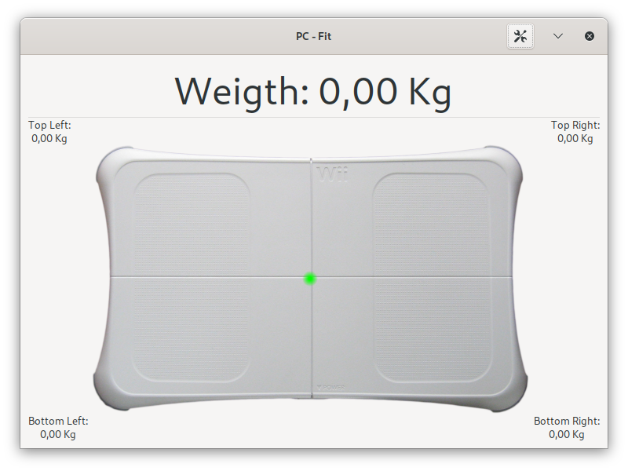

# PC-Fit
A GTK interface for the Nintendo Balance Board. You can use this program for weighing yourself, or some object.
For object under 10 kg the reported weight isn't precise, the Balance Board use four load cells and need some mass to be accurate.  

## Dependencies

This software requires those dependencies for building:

```
GTK3
Meson
xwiimote
```

## Build

```
git submodule update --init
meson builddir
cd builddir
ninja
```

## Screenshot

